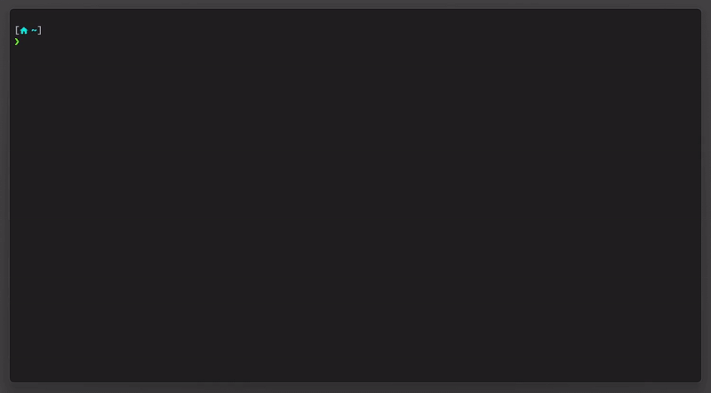

# Demo


[Neofetch](https://github.com/nepnep39/neofetch-win)
# Shell
I use [PowerShell 7](https://learn.microsoft.com/pl-pl/powershell/scripting/install/installing-powershell-on-windows) as a shell.

I've installed it via winget.
```powershell
winget install --id Microsoft.Powershell --source winget
```

## [CompletePredictor](https://github.com/PowerShell/CompletionPredictor)
I can recommend using it.

# Terminal
I will use [Windows Terminal](https://github.com/microsoft/terminal).

My settings are available in this directory. Feel free to change profiles to meet your needs.

## Color schema
Color schema is a modified version of [windows-terminal-vscode](https://github.com/cristipufu/windows-terminal-vscode-theme) schema.

## Borderless window
Please note that I use borderless terminal. To open settings or whatever you need in Windows Terminal press `ctrl + shift + p`. Borderless windows cannot be dragged in Windows so you need to use shortcuts (see [this comment](https://github.com/microsoft/terminal/issues/2238#issuecomment-997455984) for more informations). To close the terminal use `ctrl + W`.

If you want to have normal window change `Launch mode` to `Default` in `Settings -> Startup -> Launch parameters`.

## Font
I use a `CascadiaCode` nerd font that can be downoloaded from [nerdfonts.com](https://www.nerdfonts.com/font-downloads). It looks like `Cascadia Code` which is similar to `Cascadia Mono` (default in Windows Terminal).

## [Starship](https://starship.rs)
Please follow [this instruction](https://starship.rs/guide/#🚀-installation) to install Starship. Please remember to add `Invoke-Expression (&starship init powershell)` in your PowerShell configuration (I've included mine in this repo).

My starship config file is also available in this directory. Nerd font is needed for the icons to display correctly!